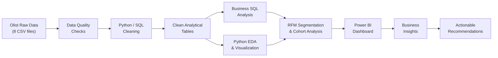
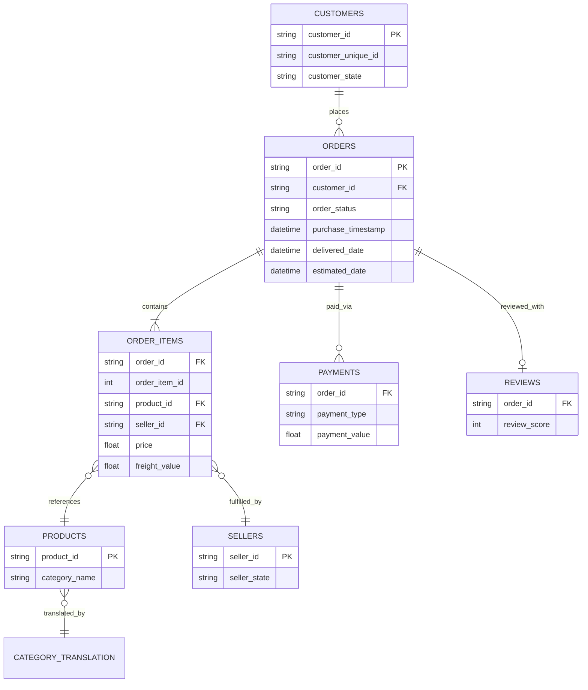
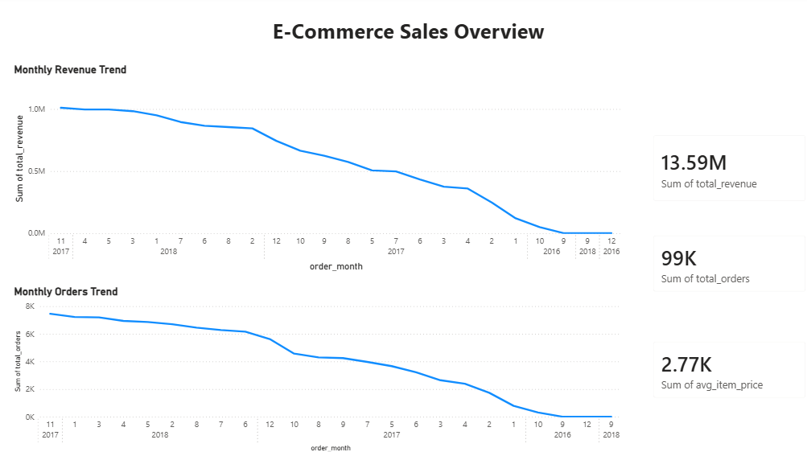
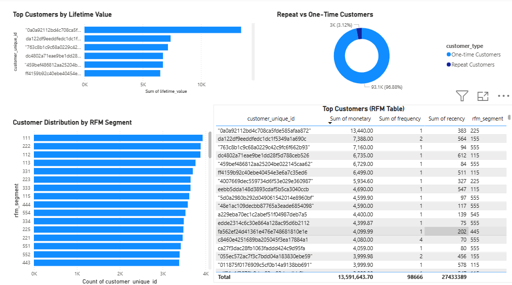
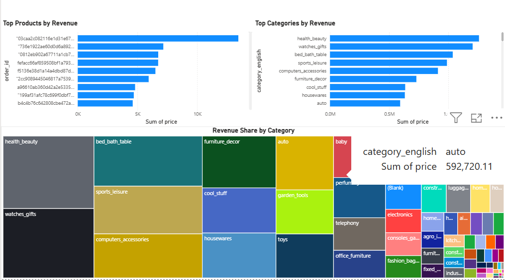

# E-Commerce Revenue, Customer & Operations Analytics

End-to-end business analytics project analyzing ~99K e-commerce orders to uncover revenue trends, customer behavior, product performance, and delivery operations using SQL Server, Python, and Power BI.

---

## Executive Summary

Analyzed a real-world e-commerce marketplace dataset (Olist, Brazil) spanning **99,441 orders** from **96,096 unique customers** across **Sep 2016 – Oct 2018**, generating **R$ 13.59M in revenue**. The analysis revealed that only **3.12% of customers are repeat buyers**, with revenue heavily concentrated in a few product categories. Late deliveries were found to correlate with significantly lower review scores. Customer segmentation using RFM identified actionable groups for targeted marketing, while cohort analysis confirmed a steep retention drop-off after first purchase.

---

## Business Problem

An e-commerce marketplace wants to understand:
- How is revenue performing, and what is driving it?
- Who are the customers, and how do they behave?
- Which products and sellers generate the most value?
- How does delivery performance affect satisfaction?
- Which customers are high-value, at-risk, or lost?

**Objective:** Identify measurable business patterns across revenue, customers, products, and operations — and translate them into actionable recommendations.

---

## Objectives

### Revenue
1. What is total revenue and the monthly trend?
2. What is Average Order Value (AOV)?
3. Which product categories generate the most revenue?

### Customers
4. How many unique customers exist?
5. What percentage are repeat buyers?
6. What is customer lifetime value distribution?
7. Which customers are high-value vs at-risk?

### Operations
8. What is the average delivery time?
9. What percentage of orders are late?
10. Does late delivery affect review scores?

### Retention
11. What does cohort retention look like?
12. Which RFM segments need attention?

---

## Dataset

**Source:** [Brazilian E-Commerce Public Dataset by Olist](https://www.kaggle.com/datasets/olistbr/brazilian-ecommerce) (Kaggle)

| Table | Rows | Key Columns |
|-------|------|-------------|
| customers | 99,441 | customer_id, customer_unique_id, state |
| orders | 99,441 | order_id, status, purchase_timestamp, delivery dates |
| order_items | 112,650 | order_id, product_id, seller_id, price, freight |
| payments | 103,886 | order_id, payment_type, value, installments |
| reviews | 99,224 | order_id, review_score |
| products | 32,951 | product_id, category_name, dimensions |
| sellers | 3,095 | seller_id, city, state |
| category_translation | 71 | Portuguese → English category names |

**Date Range:** September 2016 – October 2018

> **Note:** The geolocation table (1M rows) was excluded as it did not add sufficient analytical value within the project scope.

---

## Tools & Technologies

| Tool | Purpose |
|------|---------|
| SQL Server | Data storage, cleaning, and analytical queries |
| Python | Data loading, quality checks, EDA, feature engineering |
| Pandas / NumPy | Data manipulation and numerical analysis |
| Matplotlib / Seaborn | Visualizations |
| Power BI | Interactive dashboard |
| DAX | KPI calculations in Power BI |
| Jupyter Notebook | Analysis workflow and documentation |

---

## End-to-End Workflow



---

## Data Model



**Key relationships:**
- `customers → orders`: one-to-many (a customer can place multiple orders)
- `orders → order_items`: one-to-many (an order can have multiple items)
- `order_items → products/sellers`: many-to-one (each item references one product and one seller)
- **Important:** `customer_id` is unique per order, `customer_unique_id` tracks the same person across orders

---

## Data Cleaning

| Step | Detail |
|------|--------|
| Type casting | Converted NVARCHAR staging columns to proper types (DATETIME, FLOAT, INT) using `TRY_CAST()` |
| Text cleaning | Applied `LTRIM(RTRIM())` to all text fields |
| Date parsing | Converted 5 date columns in orders table to datetime |
| Category translation | Merged Portuguese category names with English translations |
| Delivery features | Calculated `delivery_days`, `estimated_days`, and `is_late` flag |
| Filter scope | Filtered to `order_status = 'delivered'` for revenue analysis |

---

## SQL Analysis

The SQL analysis is organized into 7 modular files demonstrating:

| SQL Concept | Where Used |
|-------------|-----------|
| CTE (Common Table Expressions) | Revenue trends, RFM, cohort analysis |
| Window Functions — `LAG()` | Month-over-month revenue growth |
| Window Functions — `RANK()`, `DENSE_RANK()` | Category/customer ranking |
| Window Functions — `ROW_NUMBER()` | Seller ranking |
| Window Functions — `NTILE(5)` | RFM scoring, CLV quartiles |
| Window Functions — `SUM() OVER()` | Cumulative revenue share, percentage calculations |
| `CASE WHEN` | RFM segment assignment, delivery status, customer type |
| `JOIN` (multi-table) | 3-4 table joins for revenue/customer analysis |
| `GROUP BY` / `HAVING` | Aggregation with filters (e.g., min review count) |
| Subqueries | Reference date for recency calculation |

### Representative Query — Monthly Revenue with MoM Growth

```sql
WITH monthly_revenue AS (
    SELECT
        FORMAT(o.order_purchase_timestamp, 'yyyy-MM') AS order_month,
        ROUND(SUM(oi.price), 2) AS revenue,
        COUNT(DISTINCT o.order_id) AS orders
    FROM orders_clean o
    JOIN order_items_clean oi ON o.order_id = oi.order_id
    WHERE o.order_status = 'delivered'
    GROUP BY FORMAT(o.order_purchase_timestamp, 'yyyy-MM')
)
SELECT
    order_month, revenue, orders,
    LAG(revenue) OVER (ORDER BY order_month) AS prev_month_revenue,
    ROUND(100.0 * (revenue - LAG(revenue) OVER (ORDER BY order_month))
        / NULLIF(LAG(revenue) OVER (ORDER BY order_month), 0), 2) AS mom_growth_pct
FROM monthly_revenue
ORDER BY order_month;
```

### Representative Query — RFM Segmentation with Named Segments

```sql
WITH rfm_base AS (
    SELECT c.customer_unique_id,
        DATEDIFF(DAY, MAX(o.order_purchase_timestamp),
            (SELECT MAX(order_purchase_timestamp) FROM orders_clean)) AS recency,
        COUNT(DISTINCT o.order_id) AS frequency,
        ROUND(SUM(oi.price), 2) AS monetary
    FROM orders_clean o
    JOIN customers_clean c ON o.customer_id = c.customer_id
    JOIN order_items_clean oi ON o.order_id = oi.order_id
    WHERE o.order_status = 'delivered'
    GROUP BY c.customer_unique_id
),
rfm_scored AS (
    SELECT *,
        NTILE(5) OVER (ORDER BY recency DESC) AS r_score,
        NTILE(5) OVER (ORDER BY frequency ASC) AS f_score,
        NTILE(5) OVER (ORDER BY monetary ASC) AS m_score
    FROM rfm_base
)
SELECT *,
    CASE
        WHEN r_score >= 4 AND f_score >= 4 AND m_score >= 4 THEN 'Champions'
        WHEN r_score >= 3 AND f_score >= 3 AND m_score >= 3 THEN 'Loyal Customers'
        WHEN r_score >= 4 AND f_score <= 2 THEN 'New Customers'
        WHEN r_score >= 3 AND f_score >= 1 AND m_score >= 2 THEN 'Potential Loyalists'
        WHEN r_score <= 2 AND f_score >= 3 THEN 'At Risk'
        WHEN r_score <= 2 AND f_score <= 2 AND m_score <= 2 THEN 'Lost / Low Value'
        ELSE 'Needs Attention'
    END AS segment
FROM rfm_scored;
```

---

## RFM Analysis

**Methodology:**

| Dimension | What it measures | Score 5 = | Score 1 = |
|-----------|------------------|-----------|-----------|
| Recency (R) | Days since last purchase | Most recent | Least recent |
| Frequency (F) | Number of orders | Most orders | Fewest orders |
| Monetary (M) | Total spend (R$) | Highest spender | Lowest spender |

Each customer scored 1-5 on each dimension using `NTILE(5)`, then mapped to named segments:

| Segment | Rule | Action |
|---------|------|--------|
| Champions | R≥4, F≥4, M≥4 | Reward loyalty, encourage referrals |
| Loyal Customers | R≥3, F≥3, M≥3 | Upsell, maintain engagement |
| New Customers | R≥4, F≤2 | Nurture toward repeat purchase |
| Potential Loyalists | R≥3, F≥1, M≥2 | Offer incentives for next purchase |
| At Risk | R≤2, F≥3 | Re-engage before they churn |
| Lost / Low Value | R≤2, F≤2, M≤2 | Low-cost win-back or deprioritize |
| Needs Attention | All other | Monitor and assess |

---

## Retention / Cohort Analysis

**Methodology:**
1. Each customer assigned a **cohort month** = month of their first purchase
2. For each subsequent order, calculate **cohort index** (months since first purchase)
3. **Retention %** = (active customers in period N) ÷ (initial cohort size) × 100

**Key finding:** Retention drops sharply after Month 0, with very few customers returning for a second purchase — consistent with the 3.12% repeat rate.

---

## Power BI Dashboard

### Page 1 — Sales Overview


### Page 2 — Customer Analytics


### Page 3 — Product & Operations


**DAX Measures Used:**

| Measure | Formula |
|---------|---------|
| Total Revenue | `SUM(order_items[price])` |
| Total Orders | `DISTINCTCOUNT(orders[order_id])` |
| AOV | `DIVIDE([Total Revenue], [Total Orders])` |
| Repeat Customer % | `DIVIDE([Repeat Customers], [Total Customers])` |
| Late Delivery % | `DIVIDE([Late Orders], [Delivered Orders])` |
| Avg Review Score | `AVERAGE(reviews[review_score])` |

---

## Key Business Insights

| # | Insight | Evidence |
|---|---------|----------|
| 1 | **Low repeat rate is the biggest challenge** | Only 3.12% of 96,096 customers made more than one purchase |
| 2 | **Revenue is category-concentrated** | Top categories (health_beauty, watches_gifts, bed_bath_table) drive a disproportionate share of R$ 13.59M total |
| 3 | **Late delivery hurts satisfaction** | Late-delivered orders have measurably lower average review scores than on-time orders |
| 4 | **Customer value is highly skewed** | Top CLV quartile (Q4) accounts for the majority of revenue; bottom quartiles contribute minimally |
| 5 | **Retention collapses after first purchase** | Cohort analysis shows near-zero retention after Month 0 across all cohorts |

---

## Business Recommendations

| # | Finding | Recommendation |
|---|---------|---------------|
| 1 | 96.9% one-time buyers | Launch post-purchase re-engagement within 30 days (email, push, discounts) |
| 2 | Revenue concentrated in few categories | Diversify marketing spend across high-potential mid-tier categories |
| 3 | Late deliveries → low reviews | Improve logistics in worst-performing states; set realistic delivery estimates |
| 4 | Large 'Lost / Low Value' RFM segment | Design targeted win-back campaigns with personalized incentives |
| 5 | Near-zero cohort retention | Implement loyalty program or second-purchase incentive to break one-time buying pattern |

---

## Validation

Key Power BI KPIs were cross-checked against SQL query results:

| Metric | SQL Result | Power BI |
|--------|-----------|----------|
| Total Revenue | R$ 13,591,643.70 | R$ 13.59M ✓ |
| Total Orders | 99,441 | 99K ✓ |
| Repeat Customer % | 3.12% | 3.12% ✓ |

---

## Repository Structure

```
ecommerce-revenue-customer-analytics/
│
├── data/
│   └── raw/                              # Olist CSV files (8 tables)
│       ├── olist_customers_dataset.csv
│       ├── olist_orders_dataset.csv
│       ├── olist_order_items_dataset.csv
│       ├── olist_order_payments_dataset.csv
│       ├── olist_order_reviews_dataset.csv
│       ├── olist_products_dataset.csv
│       ├── olist_sellers_dataset.csv
│       └── product_category_name_translation.csv
│
├── notebooks/
│   └── ecommerce_analytics.ipynb         # Python EDA & analysis
│
├── sql/
│   ├── 00_setup_database.sql             # DB + tables + bulk insert + clean
│   ├── 01_data_quality.sql               # Row counts, nulls, duplicates
│   ├── 02_revenue_analysis.sql           # Revenue KPIs, trends, AOV
│   ├── 03_customer_analysis.sql          # Repeat %, CLV, top customers
│   ├── 04_product_analysis.sql           # Category ranking, seller perf
│   ├── 05_operations_analysis.sql        # Delivery time, late %, reviews
│   ├── 06_rfm_analysis.sql              # RFM segmentation with NTILE
│   └── 07_retention_analysis.sql         # Cohort retention analysis
│
├── powerbi/
│   └── ecommerce_analytics_dashboard.pbix
│
├── images/
│   ├── executive_overview.png
│   ├── customer_analytics.png
│   └── product_operations.png
│
├── insights/
│   └── business_insights.md
│
├── requirements.txt
├── README.md
└── LICENSE
```

---

## Limitations

- **Historical observational data** — findings describe correlations, not causal relationships
- **No external market context** — cannot compare against industry benchmarks
- **Dataset time period** (2016-2018) — patterns may not reflect current marketplace behavior
- **Single marketplace** — findings are specific to Olist Brazil, not generalizable
- **No predictive modeling** in current version — analysis is descriptive and diagnostic only
- **Power BI dashboard** uses the existing data model; further refinement possible

---

## Future Scope

- **Churn prediction** — classify customers likely to not return using logistic regression
- **Customer Lifetime Value prediction** — predict future CLV based on early purchase behavior
- **Recommendation system** — suggest products based on purchase patterns
- **Predictive retention scoring** — identify at-risk customers before they churn
- **Geospatial analysis** — incorporate geolocation data for delivery route optimization

---

## License

This project is licensed under the MIT License. See [LICENSE](LICENSE) for details.

The dataset is the [Brazilian E-Commerce Public Dataset by Olist](https://www.kaggle.com/datasets/olistbr/brazilian-ecommerce), available under public license on Kaggle.

---

**Vedant Bhavsar**
